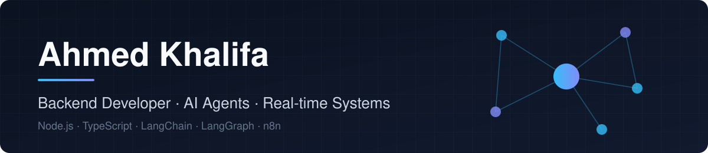

  

**Backend Developer | AI Automation & Agentic Systems (LangChain, LangGraph) | Node.js**

Cairo, Egypt · open to remote worldwide, on-site, and relocation

I build backends that hold up in production: agentic AI assistants, real-time communication systems, and workflow automation. I like taking something broken or undocumented and turning it into something a team can own.

## What I'm working on

- **AI Developer (Full-Stack) at NixAI**: building an agentic AI assistant for teams ([heydonna.co](https://heydonna.co)).

## Previously

- **Back End Developer, BarkoTel Communications**: modernized a legacy government document-workflow system (Frappe, MariaDB, 1M+ records, 1,406 users). Closed the cross-department workflow cycle and owned the database migration strategy.
- **Back End Developer, Variiance (V.connct)**: architected the real-time backend for cross-platform video conferencing (gRPC, WebRTC signaling, WebSockets, Redis Pub/Sub). Led the backend migration to Node.js. Docker CI/CD made delivery 4x faster; hot-reload config and feature flags cut deploys from 1 day to 2 hours.

## Tech

- **Core:** Node.js, TypeScript, NestJS, Express
- **AI & automation:** LangChain, LangGraph, n8n, OpenAI API, AI agents
- **Real-time & infra:** gRPC, WebSockets, WebRTC, Redis, Docker, CI/CD, Linux, AWS
- **Data:** PostgreSQL, MongoDB, MariaDB

  

## Certifications

AI / agentic (DataCamp): Building Scalable Agentic Systems · Multi-Agent Systems with LangGraph · Designing Agentic Systems with LangChain · Developing LLM Applications with LangChain

## Contact

